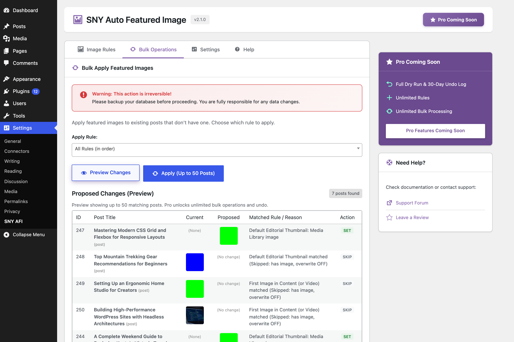
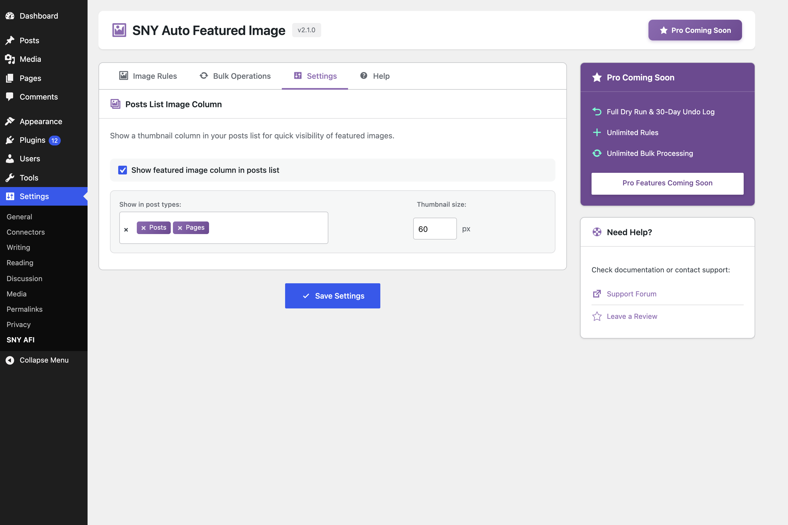
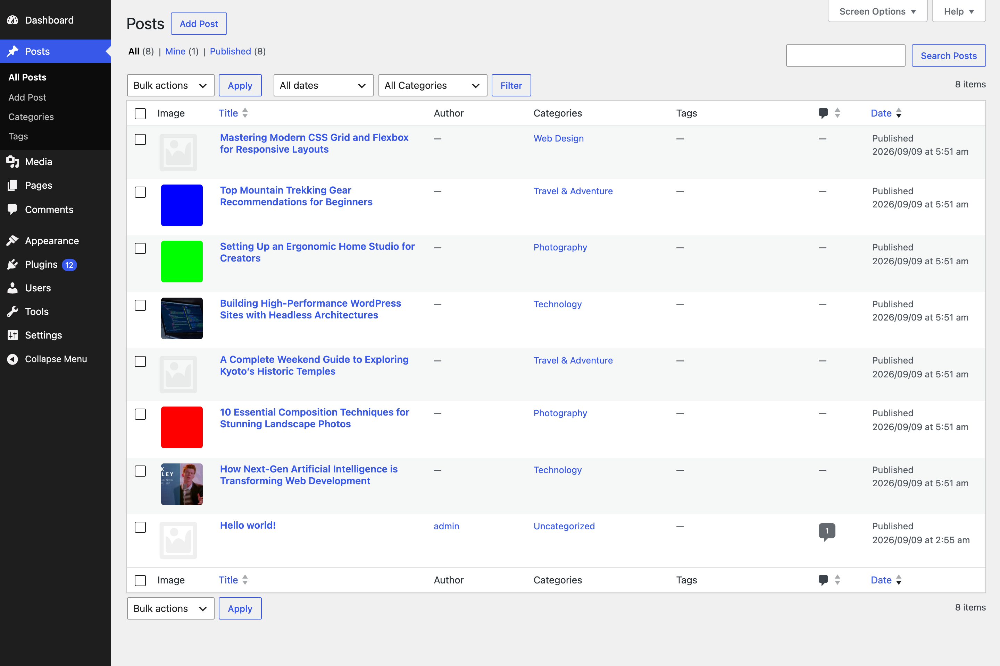

# SNY Auto Featured Image

[](https://wordpress.org/plugins/wp-auto-featured-image/)
[](https://wordpress.org/plugins/wp-auto-featured-image/)
[](https://wordpress.org/plugins/wp-auto-featured-image/)
[](https://www.gnu.org/licenses/gpl-2.0.html)

**SNY Auto Featured Image** automatically sets featured images for your WordPress posts, pages, and custom post types. Extract from content, use external URLs, set category defaults, or bulk-preview and apply to existing posts. Save time and ensure every piece of content has a professional thumbnail!

## Why Choose SNY Auto Featured Image?

Never publish a post without a featured image again. This lightweight plugin automatically assigns featured images based on your custom rules whenever you publish or update content.

## Key Features

- ✅ **Conditional Image Rules** – Set specific images based on post type, category, tag, or post status
- ✅ **Multiple Image Sources** – Media Library, first image from content, or external image URLs
- ✅ **Video Thumbnail Extraction** – Automatically extract thumbnails from embedded YouTube and Vimeo videos
- ✅ **Safe Sideloading** – Download and store external images directly in your Media Library
- ✅ **Bulk Preview & Apply** – Dry-run preview of thumbnail assignments with reasons before applying up to 50 posts
- ✅ **Admin Post List Column** – View thumbnails directly in post/page list tables with configurable sizes
- ✅ **Non-Destructive & Smart Overwrite** – Preserve existing hand-set thumbnails or selectively overwrite when needed
- ✅ **Lightweight & Fast** – Built with native WordPress APIs, no bloat, and minimal database queries
- ✅ **GDPR Compliant** – Does not collect any personal data

## Quick Setup

1. Go to **Settings → SNY AFI**
2. In the **Image Rules** tab, add a rule selecting your image source (Media Library, First Image in Content, or External URL)
3. Choose your target post types, categories, or tags
4. Visit **Bulk Operations** to preview and apply to existing posts, or simply publish new content!

## Perfect For

- **Bloggers** – Ensure consistent thumbnails across all posts
- **News Sites** – Never have a missing image in article feeds
- **WooCommerce Stores** – Default product images for quick imports
- **Developers** – Clean solution for client sites

## Installation

### From WordPress.org (Recommended)

1. Go to **Plugins → Add New** in your WordPress admin
2. Search for "SNY Auto Featured Image"
3. Click **Install Now** and then **Activate**

### Manual Installation

1. Download the latest release from [WordPress.org](https://wordpress.org/plugins/wp-auto-featured-image/)
2. Upload to `/wp-content/plugins/wp-auto-featured-image/`
3. Activate via the **Plugins** menu

## Screenshots
 
- **Image Rules Tab** – Configure conditional rules with Media Library, first image from content, and category/tag filters:
  

- **Bulk Operations Preview** – Interactive dry-run preview comparing current vs proposed thumbnails with match reasons:
  

- **Settings Tab** – Configure the admin post listing thumbnail column and customize preview thumbnail sizes:
  

- **Posts List Column** – View thumbnail status directly in your WordPress posts list:
  

## Contributing

Contributions are welcome! Please read our [Contributing Guidelines](CONTRIBUTING.md) before submitting a pull request.

### Development Setup

```bash
# Clone the repository
git clone https://github.com/sannysri/WordPress-Auto-Featured-Image.git
cd WordPress-Auto-Featured-Image

# Install dependencies
composer install

# Run all checks (lint + tests)
composer ci
```

### Available Commands

| Command | Description |
|---------|-------------|
| `composer test` | Run PHPUnit tests |
| `composer test:coverage` | Run tests with HTML coverage report |
| `composer phpcs` | Check WordPress Coding Standards |
| `composer phpcbf` | Auto-fix coding standard violations |
| `composer phpstan` | Run static analysis |
| `composer lint` | Run PHPCS + PHPStan |
| `composer ci` | Run all checks (lint + test) |

### Code Quality Standards

This plugin follows:
- **WordPress Coding Standards** (WPCS 3.0)
- **PHPStan Level 6** for static analysis
- **PHP 7.4+** compatibility
- **100% test coverage goal** for core functionality

### CI/CD Pipeline

Every pull request runs:
- ✅ PHP syntax check (7.4, 8.0, 8.1, 8.2, 8.3)
- ✅ WordPress Coding Standards (PHPCS)
- ✅ PHPStan static analysis
- ✅ PHPUnit tests with coverage

Releases are automatically deployed to WordPress.org via GitHub Actions when you create a new tag.

## Support

- 🐛 [Report a Bug](https://github.com/sannysri/WordPress-Auto-Featured-Image/issues)
- 💡 [Request a Feature](https://github.com/sannysri/WordPress-Auto-Featured-Image/issues)
- 📖 [Documentation](https://sanny.dev/?utm_source=github&utm_medium=readme&utm_campaign=sny-auto-featured-image)

## More WordPress Plugins

Check out our other WordPress plugins at [sanny.dev/plugins](https://sanny.dev/plugins/?utm_source=github&utm_medium=readme&utm_campaign=sny-auto-featured-image)

## License

This plugin is licensed under the [GPL v2 or later](https://www.gnu.org/licenses/gpl-2.0.html).

---

Made with ❤️ by [Sanny Srivastava](https://sanny.dev/?utm_source=github&utm_medium=readme&utm_campaign=sny-auto-featured-image)
