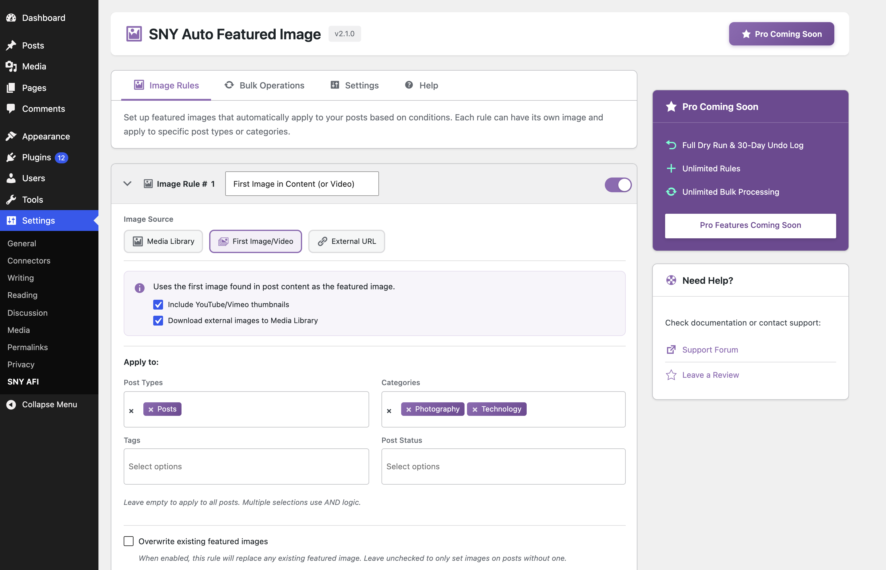

# SNY Auto Featured Image

[](https://wordpress.org/plugins/wp-auto-featured-image/)
[](https://wordpress.org/plugins/wp-auto-featured-image/)
[](https://wordpress.org/plugins/wp-auto-featured-image/)
[](https://www.gnu.org/licenses/gpl-2.0.html)

**Automatically set a default featured image** for your WordPress posts, pages, and custom post types. Save time and ensure every piece of content has a professional thumbnail!

## Why Choose SNY Auto Featured Image?

Never publish a post without a featured image again. This lightweight plugin automatically assigns your chosen default image whenever you publish or update content that lacks a featured image.

## Key Features

- ✅ **One-Click Setup** – Select any image from your media library as the default
- ✅ **Custom Post Type Support** – Works with posts, pages, WooCommerce products, and any custom post type
- ✅ **Category Filtering** – Set default images for specific categories only
- ✅ **Tag Filtering** – Target posts with specific tags
- ✅ **Non-Destructive** – Only adds images to posts without existing featured images
- ✅ **Lightweight & Fast** – No bloat, minimal database queries
- ✅ **GDPR Compliant** – Does not collect any personal data

## Quick Setup

1. Go to **Settings → SNY Auto Featured Image**
2. Choose or upload an image from the media library
3. Select your post types and categories
4. Done! New posts will automatically get your default image

## Perfect For

- **Bloggers** – Ensure consistent thumbnails across all posts
- **News Sites** – Never have a missing image in article feeds
- **WooCommerce Stores** – Default product images for quick imports
- **Developers** – Clean solution for client sites

## Installation

### From WordPress.org (Recommended)

1. Go to **Plugins → Add New** in your WordPress admin
2. Search for "SNY Auto Featured Image"
3. Click **Install Now** and then **Activate**

### Manual Installation

1. Download the latest release from [WordPress.org](https://wordpress.org/plugins/wp-auto-featured-image/)
2. Upload to `/wp-content/plugins/wp-auto-featured-image/`
3. Activate via the **Plugins** menu

## Screenshots



## Contributing

Contributions are welcome! Please read our [Contributing Guidelines](CONTRIBUTING.md) before submitting a pull request.

### Development Setup

```bash
git clone https://github.com/sannysri/WordPress-Auto-Featured-Image.git
cd WordPress-Auto-Featured-Image
```

## Support

- 🐛 [Report a Bug](https://github.com/sannysri/WordPress-Auto-Featured-Image/issues)
- 💡 [Request a Feature](https://github.com/sannysri/WordPress-Auto-Featured-Image/issues)
- 📖 [Documentation](https://sanny.dev/?utm_source=github&utm_medium=readme&utm_campaign=sny-auto-featured-image)

## More WordPress Plugins

Check out our other WordPress plugins at [sanny.dev/plugins](https://sanny.dev/plugins/?utm_source=github&utm_medium=readme&utm_campaign=sny-auto-featured-image)

## License

This plugin is licensed under the [GPL v2 or later](https://www.gnu.org/licenses/gpl-2.0.html).

---

Made with ❤️ by [Sanny Srivastava](https://sanny.dev/?utm_source=github&utm_medium=readme&utm_campaign=sny-auto-featured-image)
